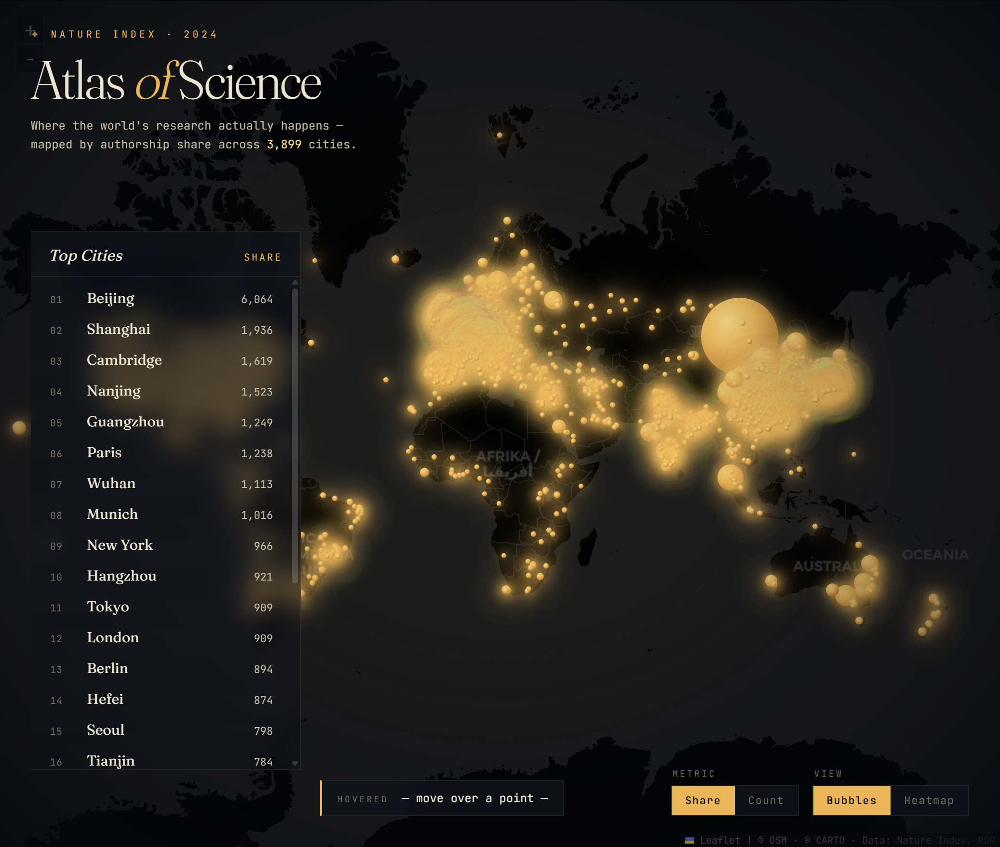

# Atlas of Science — Where Research Lives

[中文文档](README_zh.md)

Map Nature Index research institutions to cities, then visualize country/city-level research output as a dark-observatory interactive map.



## Pipeline

```
data.csv (17k institutions)
   ↓ ROR match (SQLite FTS5 trigram + acronym + Sorensen-Dice)
out/institutions.csv
   ↓ aggregate
out/city_ranking.csv       (3,899 cities)
out/country_ranking.csv    (176 countries)
   ↓ Vite + Leaflet
viz/  →  dark map with bubbles / heatmap
```

## Quick start

```bash
bun install
bun run all          # build ROR index, match, aggregate (~3 min first run)
bun run dev          # http://localhost:5173
bun run build        # → dist/
```

`bun run all` downloads the ROR v2 dataset (~50MB) from Zenodo on first run; it's cached in `.ror-cache/`.

## Visualization

- **Granularity**: City (3,899) ↔ Country (176)
- **Metric**: Share ↔ Count
- **View**: Bubbles ↔ Heatmap
- Country centroids are Share-weighted means over matched institutions.
- Hover for tooltip (top institutions / top cities), click rail entry to flyTo.

## Stack

- bun + TypeScript
- papaparse, fflate, bun:sqlite (FTS5 trigram)
- Vite, Leaflet, leaflet.heat
- CartoDB Dark Matter tiles + Fraunces / JetBrains Mono

## Data sources

- **Nature Index 2024** — institution-level Share/Count
- **ROR v2** (Research Organization Registry) — city / lat / lng per institution

## Coverage

98.1% Share coverage (74,295 / 75,728) across matched rows.
